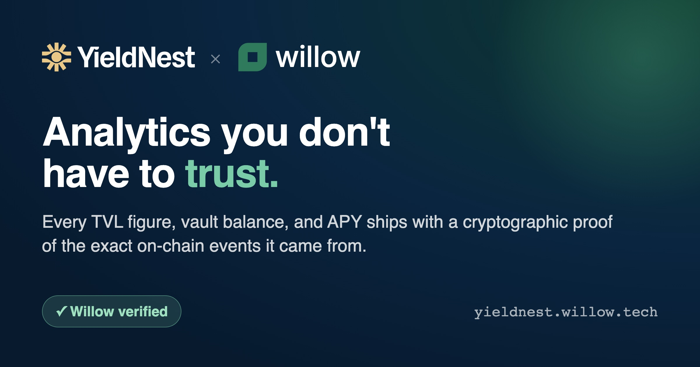

# YieldNest, verified

A YieldNest analytics dashboard where every number on the screen is backed by a proof your browser re-checks. Vault TVL, deposits, restaking flow, governance — each figure carries a **Willow verified** badge you can click to see, and re-verify, the proof behind it. Nothing here asks you to trust the server.

**Live: [yieldnest.willow.tech](https://yieldnest.willow.tech)**



## Why this is different

Most dashboards show you a number and ask you to trust that it's right — trust the indexer that produced it, trust the API that served it, trust the page rendering it. This one doesn't.

Every per-entity row carries a proof. Click the **Willow verified** badge and your browser pulls the proof, recomputes the Merkle root from it locally, and checks that the root matches the data's committed state root. If the math doesn't line up, you see a red ✗. The check runs on your machine, in client-side code you can read, with no trust in the indexer or this page.

The data itself comes from on-chain events — YieldNest's vaults, restaking contracts, and governance token, indexed directly from Ethereum.

## What you can see

- **Overview** — per-subgrove entity counts, a live chain-tip pulse, and a deposit feed
- **Earn** — total TVL in USD (live from on-chain `totalAssets()` + spot prices), cumulative deposits, top depositors, and a per-vault table
- **Portfolio** — paste an address or connect a wallet to see your deposits, withdrawals, and transfers
- **Risk Radar** — an activity-derived view: deposit velocity, owner spread, recency, restaking flow
- **Restaking** — transfer volume and largest movers across the restaking contracts
- **Governance** — YND token transfer volume, top holders, and recent transfers

## How it works

The path from an on-chain event to a verified number on the page has four steps:

1. **Subgroves** — a subgrove is a declarative description of what to index: a set of contract addresses and the events to watch. YieldNest's vaults, restaking contracts, and governance token are each defined by a manifest under [`protocol/subgroves/`](protocol/subgroves).

2. **Indexer** — a Willow indexer reads those contracts from Ethereum, decodes the events, and stores them in a Merkleized database (GroveDB). Because the store is Merkleized, every entity it holds can be served with a proof of inclusion against a single state root.

3. **Proof** — when the dashboard queries an entity, the indexer returns the data *and* a Merkle proof linking it to the committed state root.

4. **In-browser verify** — the dashboard recomputes the root from that proof, in your browser, and compares it to the committed state root. That's what the **Willow verified** badge does. The verifier is a pure-TypeScript implementation shipped in `@willow/sdk` — no server round-trip, no native code.

## What "Willow verified" actually checks

When you click the badge, the dashboard:

- fetches the entity together with its Merkle proof,
- walks the proof and recomputes the root hash locally,
- checks that the recomputed root equals the indexer's committed state root.

A green check means the data you're looking at is exactly the data that hashes up to that committed root — it hasn't been altered in transit or by the page. A red ✗ means it doesn't match, and you shouldn't trust the number.

The state root is the indexer's committed checkpoint of the indexed data. Anchoring that checkpoint into Willow's consensus is the next step on the roadmap; today the badge proves the data matches the committed root, end to end, in your browser.

## Run it locally

```bash
cd dashboard
npm install
npm run dev   # http://127.0.0.1:5273
```

The dev server proxies its data calls to a **local** Willow stack — a node on `:3031` and an indexer on `:3051` (see [`protocol/`](protocol) for bringup). To point it at different endpoints, set `VITE_WILLOW_API` and `VITE_INDEXER_GQL` in `.env.local` (copy from [`.env.example`](dashboard/.env.example)). The live TVL figures also need an Ethereum RPC key — set `ALCHEMY_ETH_KEY` for the dev `/eth-rpc` proxy.

## Build your own

The dashboard isn't special — it just reads subgroves. Point a subgrove at any contract and you can build a verified view of it the same way. The full walkthrough is in **[FORK.md](FORK.md)**; in short:

1. **Describe what to index.** Write a subgrove manifest — the contracts, their ABIs, and the events you care about. See [`protocol/subgroves/01-vaults-eth.json`](protocol/subgroves/01-vaults-eth.json) for a worked example (five ERC-4626 vaults, watching `Deposit` / `Withdraw` / `Transfer`).

2. **Index it.** Register the subgrove and run a Willow indexer against it. It reads the chain, decodes events, and serves them with proofs.

3. **Read it.** Query the indexer's GraphQL endpoint from a page like the ones in [`dashboard/`](dashboard), and drop a `<ProofBadge />` next to any row to give it the same click-to-verify behavior.

## Layout

```
.
├── dashboard/   # Vite + React UI — the pages, charts, and in-browser proof verifier
└── protocol/    # subgrove manifests, GraphQL schemas, and the indexer config
```

## Stack

- **Frontend** — Vite + React + Recharts
- **Verification** — `@willow/sdk`'s pure-TypeScript GroveDB proof verifier, running in the browser
- **Data** — Ethereum mainnet events, indexed by Willow

## Status

The dashboard renders live data for the Ethereum vaults, restaking contracts, and governance token. The liquidity view is waiting on a custom pool-math handler (see [`protocol/wasm-handlers/`](protocol/wasm-handlers)).

## License

MIT — see [LICENSE](LICENSE). The YieldNest name and logo are trademarks of YieldNest, used per their public [brand guidelines](https://docs.yieldnest.finance/brand-assets/logo-and-styleguide); the MIT license covers this repository's code, not those marks.

## Links

- [Willow](https://willow.tech)
- [YieldNest](https://yieldnest.fi)
